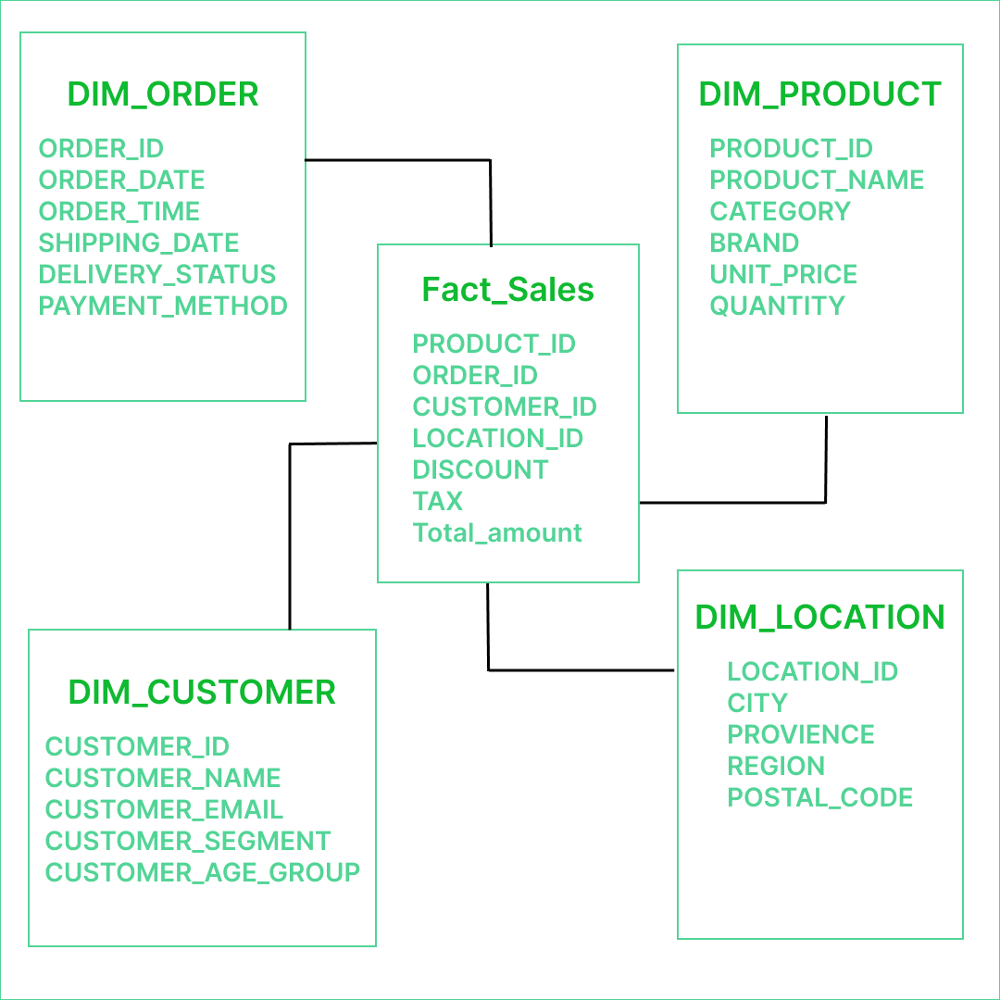

# E-Commerce-Data-Warehouse-Implementation-on-Snowflake-Multi-Source-ETL-ELT-and-Star-Schema-Design
This project focuses on designing and implementing a robust, scalable, and high-performance E-Commerce Data Warehouse on the Snowflake cloud data platform. The primary objective is to consolidate transactional and sales data from sources, cleanse the data, and transform it into a Dimensional Model (Star Schema) optimized for analytical reporting.

**Key Project Objectives**

  1.Unified Data Ingestion Strategy: Establish a versatile ETL/ELT pipeline capable of ingesting data from multiple, concurrent sources.

  2.Cross-Platform Data Migration: Execute a migration of critical historical data from an Oracle transactional database to Snowflake using Informatica as the primary integration tool.

  3.Local and Cloud Data Loading: Implement efficient, automated loading mechanisms for flat files sourced both from AWS S3 (External Stage) and local data files (Internal Stage, simulating SnowSQL uploads).

  4.Dimensional Modeling: Design and implement a robust Star Schema to replace the flat/wide staging structure, focusing on data redundancy reduction, query performance, and the accurate historical tracking of dimension attributes (SCD Type 2).

**Technical Implementation and Data Flow**
The solution leverages Snowflake's native capabilities for seamless ingestion and transformation:

  1.Continuous Data Ingestion (ELT): Data loading is handled by direct COPY INTO commands from internal and external stages, accommodating both Parquet (semi-structured) and CSV files.

  2.Data Cleansing and Staging:

    --A multi-step staging process handles initial data parsing (e.g., extracting fields from Parquet's VARIANT column) and critical data quality checks.

    --A dedicated File Format (my_csv_format) was created to successfully parse non-standard date formats (DD-MM-YYYY) present in the source CSV data.

    --The MERGE INTO operation is used to consolidate data from various source streams into a unified staging table, ensuring no data loss and handling updates/inserts accurately.

  3.Automation: Data loading from AWS is scheduled using Snowflake Tasks with CRON expressions to automate ingestion processes.

**Data Architecture (Star Schema)**

The core analytical framework is built on a Star Schema, dividing data into Facts (measures) and Dimensions (attributes).

**Tools & Technologies**

**Data Warehouse Platform:Snowflake**	: The primary cloud data warehouse platform hosting the entire analytical environment, including schemas, tables, and compute.

**Source/Transactional Database:Oracle** :	The source system for historical data, requiring migration to Snowflake.

**Cloud Storage	AWS S3** : Used as the external stage for automated loading of data files via a Storage Integration.

**ETL/Data Migration Tool:Informatica** :	The chosen tool for the complex migration and transformation of data from Oracle to Snowflake.

**Data Loading & Staging:Snowflake Stages** : Utilized both Internal Stage (int_stg)for local data and External Stage (ext_stg) for AWS S3 to auto ingest files.

**SnowSQL** :	Used for local data loading into the internal stage.

